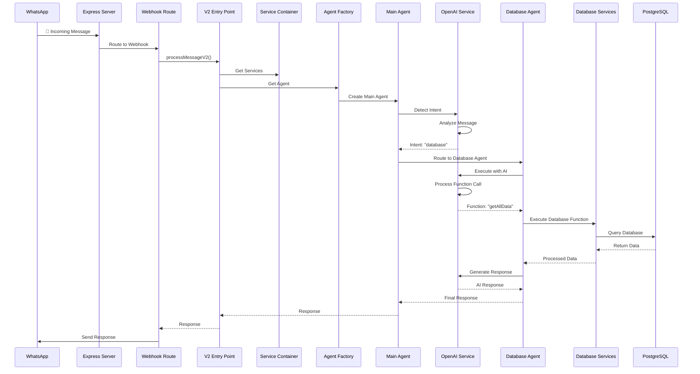
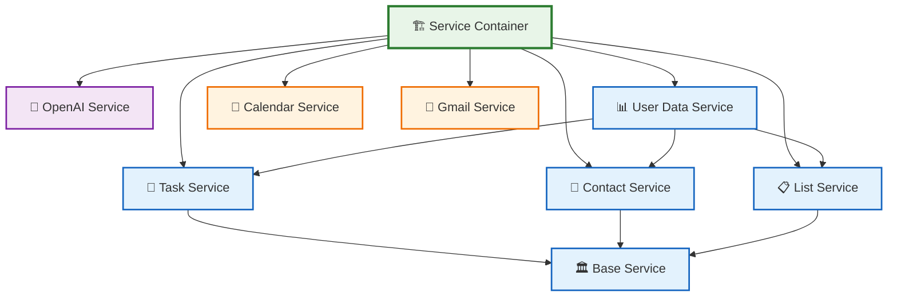
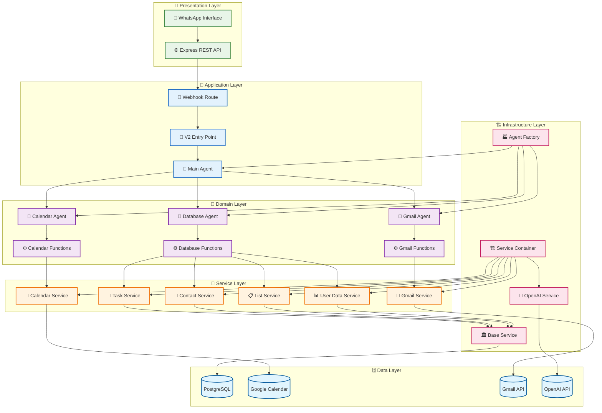

# 🏗️ WhatsApp AI Assistant - Professional Architecture V2

## Overview

This document describes the new professional, scalable architecture implemented for the WhatsApp AI Assistant. The new architecture follows enterprise-grade patterns and best practices for maintainability, testability, and scalability.

## 🎯 Key Improvements

### Before (V1)
- ❌ Mixed concerns in agent files
- ❌ Repeated code across agents
- ❌ No dependency injection
- ❌ Hard to test individual components
- ❌ Difficult to add new features
- ❌ No clear separation of layers

### After (V2)
- ✅ Clear separation of concerns
- ✅ Reusable services with CRUD operations
- ✅ Dependency injection pattern
- ✅ Easy to test and mock
- ✅ Scalable and maintainable
- ✅ Professional enterprise architecture

## 📁 Architecture Structure

```
src/
├── core/                           # Core system components
│   ├── base/                      # Base classes and handlers
│   │   ├── BaseAgent.ts          # Abstract base for all agents
│   │   ├── FunctionHandler.ts    # OpenAI function management
│   │   └── ServiceContainer.ts   # Dependency injection container
│   ├── interfaces/               # TypeScript interfaces
│   │   └── IAgent.ts            # Agent interface definitions
│   ├── types/                   # Type definitions
│   │   └── AgentTypes.ts       # Common types and interfaces
│   └── factory/                 # Factory patterns
│       └── AgentFactory.ts     # Agent creation factory
│
├── services/                     # Business logic services
│   ├── ai/                      # AI-related services
│   │   └── OpenAIService.ts    # OpenAI API wrapper
│   ├── database/               # Database services
│   │   ├── BaseService.ts      # Base service with common CRUD
│   │   ├── TaskService.ts      # Task management service
│   │   ├── ContactService.ts   # Contact management service
│   │   ├── ListService.ts      # List management service
│   │   └── UserDataService.ts  # Comprehensive user data service
│   ├── calendar/               # Calendar services
│   │   └── CalendarService.ts  # Google Calendar integration
│   └── email/                  # Email services
│       └── GmailService.ts     # Gmail integration
│
├── agents/                      # Agent implementations
│   ├── v2/                     # New agent versions
│   │   ├── DatabaseAgent.ts    # Database operations agent
│   │   ├── CalendarAgent.ts    # Calendar operations agent
│   │   ├── GmailAgent.ts       # Email operations agent
│   │   └── MainAgent.ts        # Main orchestration agent
│   └── functions/              # Function implementations
│       ├── DatabaseFunctions.ts # Database function handlers
│       ├── CalendarFunctions.ts # Calendar function handlers
│       └── GmailFunctions.ts   # Gmail function handlers
│
└── index-v2.ts                 # New entry point
```

## 🔄 System Flow Diagram

### Complete System Architecture Flow

```mermaid
graph TB
    %% External Systems
    WhatsApp[📱 WhatsApp API]
    OpenAI[🤖 OpenAI API]
    Google[📅 Google Calendar API]
    Gmail[📧 Gmail API]
    PostgreSQL[(🗄️ PostgreSQL Database)]
    
    %% Main Entry Points
    ExpressServer[🌐 Express Server<br/>index.ts]
    WebhookRoute[📨 Webhook Route<br/>webhook.ts]
    V2Entry[🚀 V2 Entry Point<br/>index-v2.ts]
    
    %% Core Architecture
    ServiceContainer[🏗️ Service Container<br/>Dependency Injection]
    AgentFactory[🏭 Agent Factory<br/>Agent Creation]
    
    %% AI Layer
    OpenAIService[🧠 OpenAI Service<br/>Intent Detection & AI Processing]
    IntentDetection{🎯 Intent Detection<br/>calendar | email | database | general}
    
    %% Agent Layer
    MainAgent[🎯 Main Agent<br/>Orchestration]
    DatabaseAgent[💾 Database Agent<br/>Data Management]
    CalendarAgent[📅 Calendar Agent<br/>Calendar Operations]
    GmailAgent[📧 Gmail Agent<br/>Email Operations]
    
    %% Function Handlers
    DatabaseFunctions[⚙️ Database Functions<br/>CRUD Operations]
    CalendarFunctions[⚙️ Calendar Functions<br/>Event Management]
    GmailFunctions[⚙️ Gmail Functions<br/>Email Management]
    
    %% Service Layer
    TaskService[📝 Task Service<br/>CRUD + Bulk Operations]
    ContactService[👥 Contact Service<br/>CRUD + Search]
    ListService[📋 List Service<br/>CRUD + Item Management]
    UserDataService[📊 User Data Service<br/>Comprehensive Overview]
    CalendarService[📅 Calendar Service<br/>Google Calendar Integration]
    GmailService[📧 Gmail Service<br/>Gmail Integration]
    
    %% Base Layer
    BaseService[🏛️ Base Service<br/>Common CRUD + Validation]
    BaseAgent[🎭 Base Agent<br/>Common AI Processing]
    FunctionHandler[🔧 Function Handler<br/>OpenAI Function Management]
    
    %% Data Flow
    WhatsApp --> ExpressServer
    ExpressServer --> WebhookRoute
    WebhookRoute --> V2Entry
    
    V2Entry --> ServiceContainer
    ServiceContainer --> AgentFactory
    AgentFactory --> MainAgent
    
    MainAgent --> OpenAIService
    OpenAIService --> IntentDetection
    
    IntentDetection -->|calendar| CalendarAgent
    IntentDetection -->|email| GmailAgent
    IntentDetection -->|database| DatabaseAgent
    IntentDetection -->|general| MainAgent
    
    %% Agent to Function Flow
    DatabaseAgent --> DatabaseFunctions
    CalendarAgent --> CalendarFunctions
    GmailAgent --> GmailFunctions
    
    %% Function to Service Flow
    DatabaseFunctions --> TaskService
    DatabaseFunctions --> ContactService
    DatabaseFunctions --> ListService
    DatabaseFunctions --> UserDataService
    
    CalendarFunctions --> CalendarService
    GmailFunctions --> GmailService
    
    %% Service Inheritance
    TaskService --> BaseService
    ContactService --> BaseService
    ListService --> BaseService
    UserDataService --> BaseService
    
    %% Agent Inheritance
    DatabaseAgent --> BaseAgent
    CalendarAgent --> BaseAgent
    GmailAgent --> BaseAgent
    MainAgent --> BaseAgent
    
    %% External API Connections
    OpenAIService --> OpenAI
    CalendarService --> Google
    GmailService --> Gmail
    BaseService --> PostgreSQL
    
    %% Function Handler Integration
    BaseAgent --> FunctionHandler
    FunctionHandler --> OpenAIService
    
    %% Styling
    classDef external fill:#e1f5fe,stroke:#01579b,stroke-width:2px
    classDef entry fill:#f3e5f5,stroke:#4a148c,stroke-width:2px
    classDef core fill:#e8f5e8,stroke:#1b5e20,stroke-width:2px
    classDef agent fill:#fff3e0,stroke:#e65100,stroke-width:2px
    classDef service fill:#fce4ec,stroke:#880e4f,stroke-width:2px
    classDef function fill:#f1f8e9,stroke:#33691e,stroke-width:2px
    classDef database fill:#e3f2fd,stroke:#0d47a1,stroke-width:2px
    
    class WhatsApp,OpenAI,Google,Gmail,PostgreSQL external
    class ExpressServer,WebhookRoute,V2Entry entry
    class ServiceContainer,AgentFactory,OpenAIService,IntentDetection core
    class MainAgent,DatabaseAgent,CalendarAgent,GmailAgent agent
    class TaskService,ContactService,ListService,UserDataService,CalendarService,GmailService service
    class DatabaseFunctions,CalendarFunctions,GmailFunctions,FunctionHandler function
    class BaseService,BaseAgent database
```

### Message Processing Flow



### Data Flow Architecture

```mermaid
graph LR
    %% User Input
    UserInput[👤 User Input<br/>"אילו רשימות יש לי?"]
    
    %% Processing Layers
    IntentLayer[🎯 Intent Detection<br/>Hebrew/English Detection]
    AgentLayer[🤖 Agent Selection<br/>Database Agent]
    FunctionLayer[⚙️ Function Execution<br/>getAllData()]
    ServiceLayer[💾 Service Layer<br/>ListService.getAll()]
    DataLayer[🗄️ Data Access<br/>PostgreSQL Query]
    
    %% Response Generation
    ResponseLayer[💬 Response Generation<br/>Hebrew Response]
    OutputLayer[📱 WhatsApp Output<br/>"הנה הרשימות שלך..."]
    
    %% Flow
    UserInput --> IntentLayer
    IntentLayer --> AgentLayer
    AgentLayer --> FunctionLayer
    FunctionLayer --> ServiceLayer
    ServiceLayer --> DataLayer
    DataLayer --> ServiceLayer
    ServiceLayer --> FunctionLayer
    FunctionLayer --> ResponseLayer
    ResponseLayer --> OutputLayer
    
    %% Styling
    classDef input fill:#e8f5e8,stroke:#2e7d32,stroke-width:2px
    classDef processing fill:#e3f2fd,stroke:#1565c0,stroke-width:2px
    classDef output fill:#fce4ec,stroke:#c2185b,stroke-width:2px
    
    class UserInput,OutputLayer input
    class IntentLayer,AgentLayer,FunctionLayer,ServiceLayer,DataLayer,ResponseLayer processing
```

### Service Dependencies



### Example Flow: "אילו רשימות יש לי כרגע?"

```mermaid
flowchart TD
    %% User Input
    UserMsg[👤 User: "אילו רשימות יש לי כרגע?"]
    
    %% Processing Steps
    WhatsAppAPI[📱 WhatsApp API<br/>Receives Message]
    ExpressServer[🌐 Express Server<br/>index.ts]
    WebhookRoute[📨 Webhook Route<br/>webhook.ts]
    V2Entry[🚀 V2 Entry Point<br/>processMessageV2()]
    
    %% Core Processing
    ServiceContainer[🏗️ Service Container<br/>Initialize Services]
    AgentFactory[🏭 Agent Factory<br/>Create Agents]
    MainAgent[🎯 Main Agent<br/>Orchestration]
    
    %% AI Processing
    OpenAIService[🧠 OpenAI Service<br/>detectIntent()]
    IntentResult[🎯 Intent: "database"]
    
    %% Agent Routing
    DatabaseAgent[💾 Database Agent<br/>processRequest()]
    DatabaseFunctions[⚙️ Database Functions<br/>userDataOperations]
    
    %% Function Execution
    UserDataFunction[📊 UserDataFunction<br/>getAllData()]
    UserDataService[📊 User Data Service<br/>getAllData()]
    
    %% Service Orchestration
    TaskService[📝 Task Service<br/>getAll()]
    ContactService[👥 Contact Service<br/>getAll()]
    ListService[📋 List Service<br/>getAll()]
    
    %% Database Queries
    TaskQuery[🗄️ SELECT * FROM tasks]
    ContactQuery[🗄️ SELECT * FROM contact_list]
    ListQuery[🗄️ SELECT * FROM lists]
    
    %% Response Generation
    DataAggregation[📊 Data Aggregation<br/>Combine Results]
    AIResponse[🤖 AI Response Generation<br/>Hebrew Response]
    FinalResponse[💬 Final Response<br/>"הנה הרשימות שלך..."]
    
    %% Output
    WhatsAppResponse[📱 Send to WhatsApp]
    
    %% Flow
    UserMsg --> WhatsAppAPI
    WhatsAppAPI --> ExpressServer
    ExpressServer --> WebhookRoute
    WebhookRoute --> V2Entry
    
    V2Entry --> ServiceContainer
    ServiceContainer --> AgentFactory
    AgentFactory --> MainAgent
    
    MainAgent --> OpenAIService
    OpenAIService --> IntentResult
    IntentResult --> DatabaseAgent
    
    DatabaseAgent --> DatabaseFunctions
    DatabaseFunctions --> UserDataFunction
    UserDataFunction --> UserDataService
    
    UserDataService --> TaskService
    UserDataService --> ContactService
    UserDataService --> ListService
    
    TaskService --> TaskQuery
    ContactService --> ContactQuery
    ListService --> ListQuery
    
    TaskQuery --> DataAggregation
    ContactQuery --> DataAggregation
    ListQuery --> DataAggregation
    
    DataAggregation --> AIResponse
    AIResponse --> FinalResponse
    FinalResponse --> WhatsAppResponse
    
    %% Styling
    classDef user fill:#e8f5e8,stroke:#2e7d32,stroke-width:3px
    classDef processing fill:#e3f2fd,stroke:#1565c0,stroke-width:2px
    classDef ai fill:#f3e5f5,stroke:#7b1fa2,stroke-width:2px
    classDef database fill:#fff3e0,stroke:#ef6c00,stroke-width:2px
    classDef response fill:#fce4ec,stroke:#c2185b,stroke-width:2px
    
    class UserMsg,WhatsAppResponse user
    class WhatsAppAPI,ExpressServer,WebhookRoute,V2Entry,ServiceContainer,AgentFactory,MainAgent,DatabaseAgent,DatabaseFunctions,UserDataFunction,UserDataService,DataAggregation processing
    class OpenAIService,IntentResult,AIResponse ai
    class TaskService,ContactService,ListService,TaskQuery,ContactQuery,ListQuery database
    class FinalResponse response
```

### Technical Architecture Layers



## 🔧 Core Components

### 1. Service Container
- **Purpose**: Dependency injection and service management
- **Benefits**: Easy testing, loose coupling, centralized configuration
- **Usage**: `ServiceContainer.getInstance().get<T>('serviceName')`

### 2. Base Agent
- **Purpose**: Common functionality for all agents
- **Benefits**: Code reuse, consistent behavior, easy maintenance
- **Features**: OpenAI integration, function handling, error management

### 3. Function Handler
- **Purpose**: Manages OpenAI function calls
- **Benefits**: Centralized function registration, type safety
- **Features**: Function registration, execution, error handling

### 4. Service Layer
- **Purpose**: Business logic implementation
- **Benefits**: Separation of concerns, testability, reusability
- **Features**: Full CRUD operations, validation, error handling

## 🚀 Key Features

### CRUD Operations
Every service supports complete CRUD operations:

```typescript
// Create
await taskService.create({ userPhone, data: taskData });

// Read (single)
await taskService.getById({ userPhone, id: taskId });

// Read (multiple)
await taskService.getAll({ userPhone, filters, limit, offset });

// Update
await taskService.update({ userPhone, id: taskId, data: updateData });

// Delete
await taskService.delete({ userPhone, id: taskId });
```

### Bulk Operations
Support for bulk operations:

```typescript
// Create multiple items
await taskService.createMultiple({ userPhone, items: taskArray });

// Bulk update/delete operations
```

### Advanced Filtering
Powerful filtering and search capabilities:

```typescript
// Filter tasks by completion status and category
const filters = {
  completed: false,
  category: 'work',
  dueDateFrom: '2024-01-01',
  dueDateTo: '2024-12-31'
};
```

### Language Support
Full Hebrew and English language support with automatic detection.

## 🔄 Usage Examples

### Basic Usage
```typescript
import { processMessageV2 } from './src/index-v2';

const response = await processMessageV2('+972501234567', 'אילו רשימות יש לי כרגע?');
console.log(response); // Hebrew response with user's lists
```

### Advanced Usage
```typescript
import { ServiceContainer } from './src/index-v2';

const container = ServiceContainer.getInstance();
const taskService = container.getTaskService();

// Create a task
const result = await taskService.create({
  userPhone: '+972501234567',
  data: {
    text: 'Complete project proposal',
    category: 'work',
    dueDate: '2024-01-15T10:00:00Z'
  }
});
```

## 🧪 Testing

The new architecture makes testing much easier:

```typescript
// Mock services for testing
const mockTaskService = {
  create: jest.fn().mockResolvedValue({ success: true }),
  getAll: jest.fn().mockResolvedValue({ success: true, data: [] })
};

// Inject mocks
container.register('taskService', mockTaskService);
```

## 📈 Performance Benefits

1. **Lazy Loading**: Services are created only when needed
2. **Singleton Pattern**: Shared instances reduce memory usage
3. **Connection Pooling**: Database connections are reused
4. **Caching**: Service instances are cached
5. **Efficient Queries**: Optimized database queries with proper indexing

## 🔒 Security Features

1. **Input Validation**: All inputs are validated and sanitized
2. **SQL Injection Protection**: Parameterized queries
3. **User Isolation**: Each user's data is properly isolated
4. **Error Handling**: Sensitive information is not exposed in errors

## 🚀 Migration Guide

### From V1 to V2

1. **Update imports**:
   ```typescript
   // Old
   import { processMessage } from './src/agents/mainAgent';
   
   // New
   import { processMessageV2 } from './src/index-v2';
   ```

2. **Update function calls**:
   ```typescript
   // Old
   const response = await processMessage(userPhone, message);
   
   // New
   const response = await processMessageV2(userPhone, message);
   ```

3. **Access services directly** (optional):
   ```typescript
   import { ServiceContainer } from './src/index-v2';
   const container = ServiceContainer.getInstance();
   const taskService = container.getTaskService();
   ```

## 🎯 Future Enhancements

1. **Middleware System**: Authentication, logging, rate limiting
2. **Event System**: Pub/sub for real-time updates
3. **Caching Layer**: Redis integration for performance
4. **Monitoring**: Health checks and metrics
5. **API Documentation**: Auto-generated API docs
6. **Testing Suite**: Comprehensive unit and integration tests

## 📊 Comparison

| Feature | V1 | V2 |
|---------|----|----|
| Code Reusability | ❌ | ✅ |
| Testability | ❌ | ✅ |
| Maintainability | ❌ | ✅ |
| Scalability | ❌ | ✅ |
| CRUD Operations | ❌ | ✅ |
| Bulk Operations | ❌ | ✅ |
| Language Support | ✅ | ✅ |
| Error Handling | Basic | Advanced |
| Type Safety | Partial | Full |

## 🎉 Conclusion

The new V2 architecture provides a solid foundation for building enterprise-grade AI assistants. It follows industry best practices and makes the codebase more maintainable, testable, and scalable.

The architecture is designed to grow with your needs, making it easy to add new features, integrate with new services, and handle increased load as your application scales.
