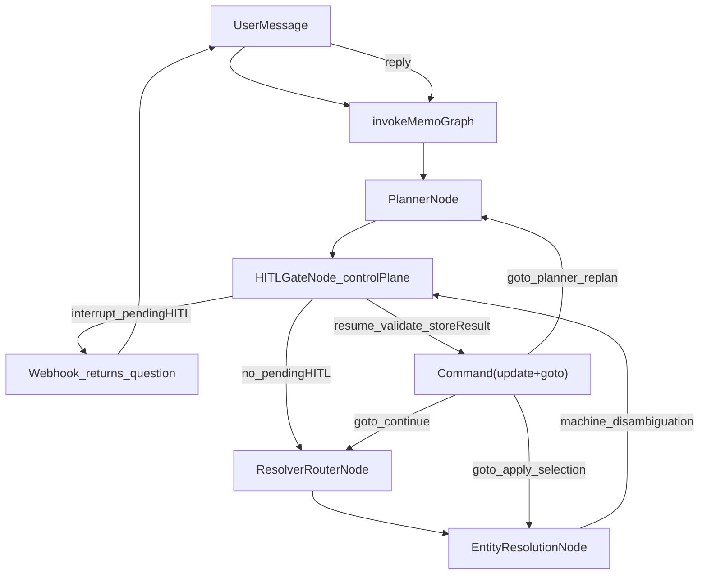

# HITL control-plane contract refactor

## Goal

Refactor Memo_v2 HITL from scattered conditional interrupts into a **single contract-driven control-plane** with:

- **One canonical pending HITL object** (`pendingHITL`) at a time
- **Deterministic resume routing** using explicit `returnTo`
- **Structured, grep-friendly logging** by `hitlId`
- **Hard separation** of planner HITL vs entity-resolution disambiguation
- **No backward compatibility**: remove legacy flags/branches and unused code paths

## Current runtime anchors (verified)

- `hitl_gate` currently drives both planner HITL and entity disambiguation using `needsHITL/hitlReason/disambiguation/hitlType/plannerHITLResponse`.
- Graph routing today:
  - `Memo_v2/src/graph/index.ts`: `hitlGateRouter()` routes only via `hitlType` (planner) and `entityResolutionRouter()` routes via `needsHITL && hitlReason==='disambiguation'`.
- TTL: enforce **5 minutes** everywhere. Update `Memo_v2/src/graph/index.ts` from current 1 min to 5 min; set `expiresAt` default and all docs to 5 minutes (WhatsApp replies are often late).

## Contract design

### 1) Add canonical HITL types

- Add new file: `Memo_v2/src/types/hitl.ts`
  - `HITLKind = 'clarification' | 'approval' | 'disambiguation'`
  - `PendingHITL` exactly as specified in the request (including `returnTo` and `context`), plus required fields:
    - `version: 1`
    - `originStepId: string` (generic origin for every HITL; ties pause to the triggering step deterministically)
    - `policySource?: 'risk_engine' | 'planner' | 'tool_policy' | 'entity_policy'` (approval audit)
    - `expiresAt?: string` (ISO; zombie-approval protection)
  - `HITLResultEntry = { raw: string; parsed: any; at: string }`
- Re-export from `Memo_v2/src/types/index.ts`.

### 2) Extend interrupt payload metadata (audit + timeout)

- In `Memo_v2/src/types/index.ts`, extend `InterruptPayload.metadata` (additive) to include:
  - `hitlId`, `kind`, `source`, `expectedInput`, `returnTo`
- Keep existing fields (`stepId`, `candidates`, `interruptedAt`) for `invokeMemoGraph()` timeout logic.

## State refactor

### 3) Update MemoState contract (canonical only + idempotency)

- Update `Memo_v2/src/graph/state/MemoState.ts`:
  - Add:
    - `pendingHITL: PendingHITL | null`
    - `hitlResults: Record<string, { raw: string; parsed: any; at: string }>`
    - `traceId: string` (stable across resume; used in logs + operationId)
    - `executedOperations: Record<string, { at: string; stepId: string; capability: string; argsHash: string; success: boolean; resultHash: string; externalIds?: Record<string, string | string[]> }>` (persistent PII-safe ledger; MUST NOT store full `ExecutionResult.data`).
  - Keep and clarify (do not remove):
    - `executionResults: Map<string, ExecutionResult>` — **existing field**; remains **authoritative** for response formatting; may contain PII; **ephemeral** (checkpoint-scoped run state only, not long-term persistence).
  - Persistence rule: **executedOperations** = persistent PII-safe ledger for idempotency; **executionResults** = runtime full results for response formatting only.
  - Remove (as requested):
    - `needsHITL`
    - `hitlReason`
    - `hitlType`, `plannerHITLResponse`, and any other legacy HITL ad-hoc state
  - Keep `disambiguation` but enforce it as **machine-only** (candidates + resolverStepId + originalArgs + allowMultiple + domain hint). Remove/stop using any user-facing `question` fields in state.
  - Ensure `traceId` is set early and persisted:
    - `ContextAssemblyNode` should set `state.traceId` once (e.g. from `input.whatsappMessageId` or a generated UUID) and never overwrite it.

## Graph routing refactor

### 4) Deterministic resume routing in graph routers

- Update `Memo_v2/src/graph/index.ts` routers:
  - Remove `hitlGateRouter()` conditional edge entirely. Wire `hitl_gate` with a normal edge (default: `resolver_router`).
  - Implement HITL resume routing inside `HITLGateNode` using LangGraph `Command({ update, goto })`, where `goto` is derived directly from `pendingHITL.returnTo` (canonical source; no duplicated routing state).
  - Replace `entityResolutionRouter()` logic to route to `hitl_gate` when **machine disambiguation exists** (e.g. `state.disambiguation` is present and not yet resolved into `executorArgs`).

### 4b) Tool idempotency guard (required)

- Update `Memo_v2/src/graph/nodes/ExecutorNode.ts` to enforce an idempotency ledger:
  - Define `operationId = state.traceId + ':' + stepId` (industry rule).
  - Before executing any adapter call, check `state.executedOperations[operationId]`:
    - If present → **skip execution** and reuse `state.executionResults.get(stepId)` (authoritative full result for response formatting).
      - If `executionResults` entry is missing but ledger exists: do **not** re-run side effects; return a safe failure and log `IDEMPOTENCY_MISSING_RESULT`.
    - If absent → execute, write normal `state.executionResults.set(stepId, ExecutionResult)` AND persist a **PII-safe** ledger entry.
      - Persist only: `success`, `externalIds` (ids only), `resultHash` (computed), `argsHash`.
  - `argsHash` should be a stable hash of the final executed args (use resolved args from `executorArgs`), to detect drift across retries.
  - This must cover webhook retries and any resume/re-entry path (not just HITL).

## HITLGateNode refactor (control-plane)

### 5) Implement canonical HITL control-plane behavior

Refactor `Memo_v2/src/graph/nodes/HITLGateNode.ts` into:

- **Contract manager**
  - Creates exactly one `pendingHITL` per interruption.
  - Writes structured interrupt logs.
- **Resume validator**
  - Validates user reply vs `expectedInput`:
    - `yes_no`: normalize multilingual yes/no
    - `single_choice`: accept numeric (1-based) and option id
    - `multi_choice`: accept “2 3” / “2,3” / ranges if desired
    - `free_text`: non-empty
  - On invalid: re-interrupt with same `hitlId` and an error-prefixed question (language-aware), without mutating other state.
- **Separation of sources**
  - **Entity disambiguation**: if `state.disambiguation` exists (machine-only), create `PendingHITL` with:
    - `kind: 'disambiguation'`
    - `source: 'entity_resolution'`
    - `originStepId: resolverStepId`
    - `returnTo: { node:'entity_resolution', mode:'apply_selection' }`
    - `context: { resolverStepId, originalArgs, candidates }`
  - **Planner HITL**: if planner indicates HITL (confidence/missingFields/risk/needsApproval), create `PendingHITL` with:
    - `source:'planner'`
    - `originStepId`:
      - Use the triggering plan step id when available: `state.plannerOutput.plan[0].id` (or the highest-risk step id if multiple)
      - If plan is empty/missing, use `'planner'` as a last resort
    - `kind` mapped per spec:
      - `intent_unclear`/`missing_fields` → clarification
      - `confirmation`/`high_risk` → approval
    - `policySource` (approval only):
      - planner high-risk / needsApproval → `policySource: 'planner'` (or `'risk_engine'` if later separated)
      - policy_violation/tool_requires_review → `policySource: 'tool_policy'`
    - `returnTo` mapping:
      - `intent_unclear` → `{ node:'planner', mode:'replan' }`
      - other clarifications/approvals → `{ node:'planner', mode:'continue' }`
  - **LLM guardrails (required)**:
    - LLM may generate **question text only**.
    - LLM must never control: `options[].id`, `options[].label`, option count/order, `expectedInput`, `returnTo`, or metadata.
    - Implementation approach: build `PendingHITL.options` deterministically in code; optionally call LLM and store only `{ questionTextOnly }` into `PendingHITL.question`.
    - For disambiguation, do not use LLM for options at all.

### 6) HITL lifecycle storage

- On interrupt:
  - Persist `pendingHITL` in state.
  - Add assistant question to MemoryService once.
  - Log JSON:
    - `{ traceId, threadId, hitlId, kind, reason, source, returnTo }`
- On resume (valid):
  - Write `hitlResults[hitlId] = { raw, parsed, at }` (store `returnTo` inside `parsed` if needed for auditability).
  - Clear `pendingHITL`.
  - Return `new Command({ update: {...}, goto })` where `goto` is derived from `pendingHITL.returnTo`:
    - planner + replan → `goto: 'planner'`
    - planner + continue → `goto: 'resolver_router'`
    - entity_resolution + apply_selection → `goto: 'entity_resolution'`
  - Log JSON:
    - `{ traceId, threadId, hitlId, parsedResult, returnTo }`

### 6b) Strict stale-resume + expiry policy (required)

- **Stale reply (pendingHITL === null)**:
  - If a user replies while the thread has pending interrupts but `pendingHITL === null`, do **not** run the graph as a fresh instruction.
  - Respond with a friendly prompt: “I’m not waiting on a question right now — what would you like to do?”
  - Log `HITL_STALE_REPLY` with `{ threadId, rawUserMessage }`.
  - Cleanup: delete thread checkpoints **only when confident it is a stale HITL reply** (e.g. message looks like a typical HITL answer: "yes"/"no"/"1"/"2"/"כן"/"לא"), not when the message could be new user intent — to avoid nuking active sessions.
- **Expiry (pendingHITL.expiresAt)**:
  - `pendingHITL.expiresAt` must be set when creating HITL (default TTL: **5 minutes**, enforced consistently across docs + runtime).
  - On resume, if `now > expiresAt`:
    - Clear pending HITL (delete thread checkpoints).
    - Respond: “That request expired — want to try again?”
    - Log `HITL_EXPIRED` with `{ traceId, threadId, hitlId, originStepId }`.
    - Do not resume tool execution.
- **Defense-in-depth in HITLGateNode**:
  - If invoked with a present-but-expired `pendingHITL`, clear it and `interrupt()` with the expiry message and log `HITL_EXPIRED`.

## Entity-resolution subsystem refactor

### 7) Make entity resolvers machine-only

- Update `Memo_v2/src/services/resolution/types.ts`:
  - Remove user-facing text from `ResolutionOutput` (`question` etc.).
  - Add machine fields where needed, e.g. `disambiguationKind?: 'pick_one' | 'pick_many' | 'recurring_scope' | 'conflict_override'` and/or `validationErrorCode?: 'invalid_selection'`.
- Refactor all entity resolvers to comply:
  - `Memo_v2/src/services/resolution/DatabaseEntityResolver.ts`
  - `Memo_v2/src/services/resolution/CalendarEntityResolver.ts`
  - `Memo_v2/src/services/resolution/GmailEntityResolver.ts`
  - `Memo_v2/src/services/resolution/SecondBrainEntityResolver.ts`
  - Disambiguation outputs become:
    - `{ type:'disambiguation', candidates, allowMultiple?, disambiguationKind? }`
  - `applySelection(...)` must return machine outputs only (no user-facing strings).

### 8) Update EntityResolutionNode to new contract

- Update `Memo_v2/src/graph/nodes/EntityResolutionNode.ts`:
  - When `resolve()` returns `type:'disambiguation'`, write machine-only `state.disambiguation` (no question text) and return so router sends to `hitl_gate`.
  - On resume, read selection from canonical HITL result (from `hitlResults`) and apply it via `applySelection`, then write `executorArgs`.
  - Preserve “not_found/clarify_query does not interrupt” behavior.

## Industry cases support

### 9) Add canonical reason support

- Allow `PendingHITL.reason` to carry additional reasons:
  - `tool_requires_review`, `low_confidence_plan`, `ambiguous_scope`, `policy_violation`
- Implement mapping in `HITLGateNode` so these reasons are represented as:
  - clarification (for ambiguous_scope/low_confidence_plan)
  - approval (for tool_requires_review/policy_violation)

## Docs and migration notes (must match runtime)

### 10) Update docs to match the new contract

Update:

- `Memo_v2/docs/STATE_SCHEMA.md` (new state fields + removed flags)
- `Memo_v2/docs/PLANNER_AND_HITL_FLOW.md` (new lifecycle and resume routing)
- `Memo_v2/docs/SYSTEM_DIAGRAM.md` (update diagrams to show `pendingHITL` control-plane)
- `docs/project-instruction/orchestrator-and-flows.md` and **runtime** in `Memo_v2/src/graph/index.ts`: set HITL timeout/expiry to **5 minutes** everywhere (update current 1 min in code to 5 min).

### 11) Add explicit migration notes

- Add `Memo_v2/docs/HITL_MIGRATION_NOTES.md`:
  - What removed: `needsHITL`, `hitlReason`, `hitlType`, `plannerHITLResponse`, `disambiguation.question`, `disambiguation.resolved`, and any other ad-hoc HITL flags
  - New single contract: `pendingHITL` + `hitlResults`
  - Deterministic resume routing: `HITLGateNode` returns `Command({ update, goto })` derived from `pendingHITL.returnTo`

## Mermaid diagram (new HITL architecture)

Include in `Memo_v2/docs/PLANNER_AND_HITL_FLOW.md` (and optionally `SYSTEM_DIAGRAM.md`):

## Edge cases to test

- Resume with **no** `pendingHITL` (stale reply) → do not treat as new instruction; respond with “not waiting” message; log `HITL_STALE_REPLY`; reset checkpoints.
- Resume with wrong input for `expectedInput` (e.g., text when choice required) → re-interrupt with error.
- Multi-choice responses: `"1 2"`, `"1,2"`, Hebrew “שניהם/כולם”, English “both/all”.
- Entity disambiguation where candidates length changes between interrupt and resume (should be stable; if not, re-resolve).
- Recurring-series choice (calendar) expressed as natural language (“all occurrences”, “רק את זה”).
- **Idempotency**: after resume (and also on webhook retries), `ExecutorNode` must skip any already-executed side-effecting step using `operationId = traceId + stepId` from `executedOperations`.
- Two HITL triggers in one run (should never create a second `pendingHITL`; must log and prefer the existing one).
- not_found/clarify_query from entity resolvers still produces explanation without interrupt.

## Files expected to change (core)

- `Memo_v2/src/types/hitl.ts` (new)
- `Memo_v2/src/types/index.ts`
- `Memo_v2/src/graph/state/MemoState.ts`
- `Memo_v2/src/graph/index.ts`
- `Memo_v2/src/graph/nodes/ContextAssemblyNode.ts` (set stable `traceId` once; preserve across resume)
- `Memo_v2/src/graph/nodes/HITLGateNode.ts`
- `Memo_v2/src/graph/nodes/EntityResolutionNode.ts`
- `Memo_v2/src/services/resolution/types.ts`
- `Memo_v2/src/services/resolution/*EntityResolver.ts`
- `Memo_v2/src/graph/nodes/ExecutorNode.ts` (idempotency ledger enforcement)
- `Memo_v2/src/graph/nodes/PlannerNode.ts` + `Memo_v2/src/graph/resolvers/BaseResolver.ts` (replace removed legacy `plannerHITLResponse` with `hitlResults` lookup)
- Docs: `Memo_v2/docs/`* + `docs/project-instruction/orchestrator-and-flows.md`

