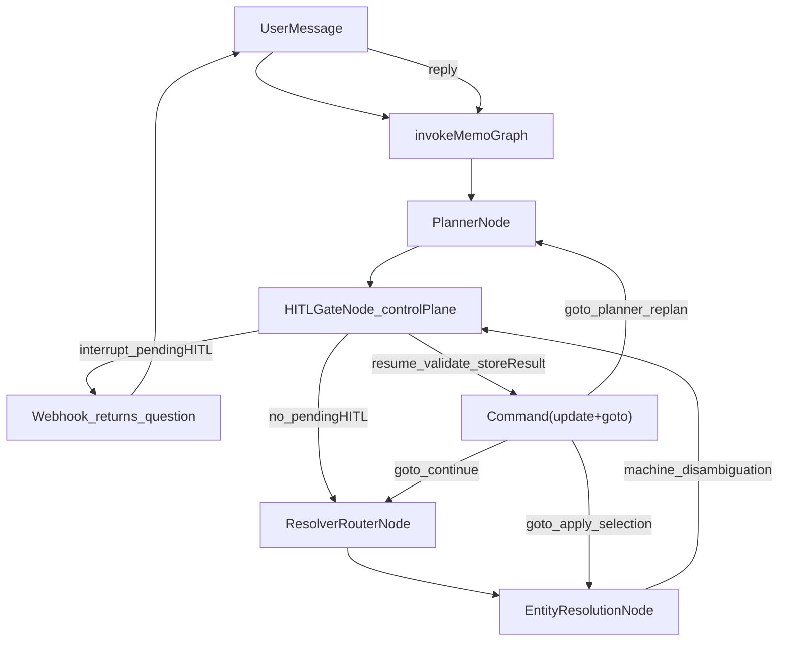
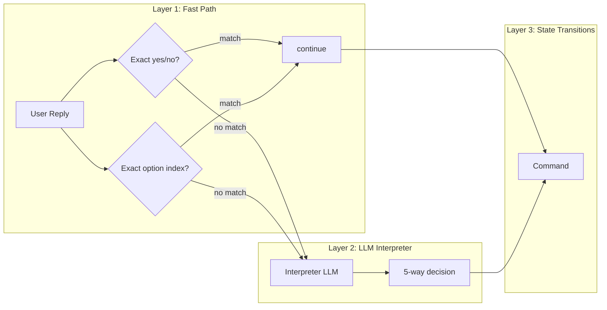

# Memo V2 — Planner & HITL (Current Flow Contract)

This doc explains **exactly** how Planner + HITL work in the current Memo_v2 runtime, including the canonical `pendingHITL` control-plane contract.

## Canonical code

- Graph + routers + timeout: `Memo_v2/src/graph/index.ts`
- Planner: `Memo_v2/src/graph/nodes/PlannerNode.ts`
- HITL control-plane: `Memo_v2/src/graph/nodes/HITLGateNode.ts`
- Entity resolution: `Memo_v2/src/graph/nodes/EntityResolutionNode.ts`
- State: `Memo_v2/src/graph/state/MemoState.ts`
- Types: `Memo_v2/src/types/index.ts`, `Memo_v2/src/types/hitl.ts`

## Overview

Planner produces a structured `plannerOutput` plan. HITL uses LangGraph `interrupt()` to pause when execution is risky or under-specified, and resumes via `Command({ resume: userMessage })`.

The HITL system uses a **single canonical contract**: one `pendingHITL` object in state at a time, with deterministic resume routing via `Command({ update, goto })`.

There are **two HITL families** (both managed by `HITLGateNode`):

- **Planner HITL**: Clarification / approval (low confidence, missing fields, high risk, needs approval, intent unclear).
- **Entity-resolution HITL**: Disambiguation selection (user chooses between candidate entities).

## Architecture diagram



## 1) Planner output contract (LLM)

Planner writes `state.plannerOutput`:

- `intentType`: `"operation" | "conversation" | "meta"`
- `confidence`: \(0..1\)
- `riskLevel`: `"low" | "medium" | "high"`
- `needsApproval`: boolean
- `missingFields`: string[] — when non-empty, triggers `reason:'missing_fields'` HITL. Known values (see PlannerNode system prompt): `reminder_time_required` (reminder needs specific date+time; use when user said "תזכיר לי" with day but no time, or no date/time), `target_unclear`, `time_unclear`, `which_one`, `intent_unclear`.
- `plan`: `PlanStep[]`

Planner also writes `state.routingSuggestions` (pattern hints) used for HITL clarification wording.

Planner receives `state.latestActions` (last 3, most-recent first) as a tiny hint block. When user uses referential language ("it/that/זה/אותו"), planner uses the most-recent action as the strongest candidate. Only emits `intent_unclear` when no latestAction is plausible.

## 2) HITL trigger rules

In `HITLGateNode.checkPlannerHITLConditions()` (priority order):

1. If `missingFields` includes **`intent_unclear`** → `reason:'intent_unclear'`, `kind:'clarification'`
2. Else if `confidence < 0.7` → `reason:'low_confidence_plan'`, `kind:'clarification'`
3. Else if `missingFields.length > 0` → `reason:'missing_fields'`, `kind:'clarification'`
4. Else if `riskLevel === 'high'` → `reason:'high_risk'`, `kind:'approval'`
5. Else if `needsApproval === true` → `reason:'needs_approval'`, `kind:'approval'`
6. Else → continue (no HITL)

For entity disambiguation:
- If `state.disambiguation` has unresolved candidates → `kind:'disambiguation'`, `source:'entity_resolution'`

## 3) PendingHITL contract

When HITL is triggered, `HITLGateNode` creates exactly one `PendingHITL` object:

```typescript
{
  version: 1,
  hitlId: string,          // UUID, unique per interruption
  kind: HITLKind,          // 'clarification' | 'approval' | 'disambiguation'
  source: HITLSource,      // 'planner' | 'entity_resolution' | ...
  reason: HITLReason,      // 'intent_unclear' | 'missing_fields' | 'high_risk' | ...
  originStepId: string,    // Ties to triggering step
  returnTo: HITLReturnTo,  // Deterministic resume destination
  expectedInput: HITLExpectedInput,  // 'yes_no' | 'single_choice' | 'multi_choice' | 'free_text'
  question: string,        // User-facing question text
  options?: PendingHITLOption[],     // Machine-controlled options
  policySource?: HITLPolicySource,   // For approval audit
  expiresAt: string,       // ISO timestamp (TTL = 5 minutes)
  context?: { ... },       // Disambiguation-specific context
  createdAt: string,
}
```

### returnTo mapping

| Source | Reason | returnTo |
|--------|--------|----------|
| planner | intent_unclear | `{ node:'planner', mode:'replan' }` |
| planner | missing_fields, low_confidence, confirmation, high_risk, approval | `{ node:'resolver_router', mode:'continue' }` |
| entity_resolution | disambiguation | `{ node:'entity_resolution', mode:'apply_selection' }` |

## 4) Resume processing — three-layer architecture

On resume, `HITLGateNode.handleResumeInline()` processes the user's reply through three layers:



### Layer 1 — Fast path (no LLM, cheapest)

Before any LLM call, deterministic matching is attempted:

- **yes_no**: Multilingual keyword list (Hebrew/English: "yes", "כן", "no", "לא", "sure", "ok", etc.)
- **single_choice**: Exact numeric index (1-based) or exact option id/label match
- **multi_choice**: Numeric indices ("2 3", "2,3") or "both"/"all"/"שניהם"/"כולם"
- **free_text**: Any non-empty string

If the fast path matches, the decision is `continue` — no LLM needed.

**Entity disambiguation** always uses deterministic validation only (no interpreter). If the reply does not match any option, it is treated as `switch_intent` (re-routed to planner as a new request).

### Layer 2 — LLM Interpreter (for planner HITL only)

When the fast path does not match (planner HITL only), a single LLM call classifies the reply into one of **five decisions**:

| Decision | When | Example |
|----------|------|---------|
| `continue` | User answered the question correctly | "go ahead", "do it", "3pm" |
| `continue_with_modifications` | User approved AND added extra changes to the **same** operation | "Yes, and change the name to Wedding" |
| `switch_intent` | User's reply is about a **different** topic/intent | "What are my events tomorrow?" (during a delete confirmation) |
| `cancel` | User explicitly cancels the pending operation | "never mind", "forget it", "ביטול" |
| `re_ask` | User tried to answer but the reply is unclear | "what?", "hmm", "maybe" |

**Interpreter model**: `gpt-4o-mini`, temperature 0.1, max 200 tokens.

**Interpreter output format** (strict JSON):
```typescript
{
  decision: HITLInterpreterDecision,   // one of the 5 values above
  parsed?: {
    approved?: boolean,                // for yes_no contexts
    answer?: string,                   // the user's actual answer
    modifications?: Record<string, unknown>  // semantic field changes only
  }
}
```

On parse failure or unknown decision, the interpreter falls back to `re_ask` (safest).

### Layer 3 — State transitions

Each decision maps to a specific `Command({ update, goto })`:

| Decision | State update | goto |
|----------|-------------|------|
| `continue` | Clear `pendingHITL`, write `hitlResults` | `pending.returnTo` (planner or resolver_router) |
| `continue_with_modifications` | Clear `pendingHITL`, write `hitlResults`, merge modifications into plan step, **clear** `resolverResults` and `executorArgs` for that step | `resolver_router` (re-resolve with updated plan) |
| `switch_intent` | Clear `pendingHITL`, replace `input.message` with user reply, clear `plannerOutput` | `planner` (fresh plan for new intent) |
| `cancel` | Clear `pendingHITL`, set `finalResponse` to cancellation message | `response_writer` |
| `re_ask` | Keep `pendingHITL`, re-interrupt with nudge question | (same interrupt, recursive) |

**`continue_with_modifications` detail**: The interpreter extracts semantic field names (e.g. `title`, `time`, `location`) from the user's reply. These are merged into the triggering plan step's `constraints` and `changes`. The step's resolver cache is cleared so it re-runs with the updated plan. The interpreter **cannot** invent entity IDs — a code-level allowlist (`ALLOWED_MODIFICATION_FIELDS`) strips any ID-like keys. Entity resolution and execution remain deterministic.

## 5) HITL result storage

```typescript
hitlResults[hitlId] = {
  raw: string,      // User's raw reply
  parsed: any,      // Validated/normalized value
  at: string,       // ISO timestamp
  returnTo?: HITLReturnTo,   // Audit trail
  interpreted?: HITLInterpreterOutput  // Present when LLM interpreter ran
}
```

The `interpreted` field captures the full interpreter decision and parsed modifications for audit logging.

## 6) Multi-HITL guard

If `pendingHITL !== null` and a new HITL condition is triggered in the same run:
- Logs `HITL_DUPLICATE_ATTEMPT`
- Ignores the new request
- Continues with the existing `pendingHITL`

This prevents race-like behavior if planner + resolver both request HITL in the same tick.

## 7) Expiry policy

### Expiry (pendingHITL.expiresAt)

- Default TTL: **5 minutes** (`HITL_TTL_MS` in `Memo_v2/src/types/hitl.ts`)
- On expired interrupt in `invokeMemoGraph()`:
  - Delete thread checkpoints
  - Log `HITL_EXPIRED`
  - **Fall through to fresh invocation** — the user's current message is processed as a new request, not blocked with an expiry error
  - The HITL question is already in `MemoryService` (from `addInterruptMessageToMemory`), so the planner sees full conversation context
- Defense-in-depth: `HITLGateNode.handleResumeInline()` also checks `expiresAt` and returns an expiry message if the `invokeMemoGraph` check was missed

### Conversation context continuity

All HITL interactions (question + user reply) are persisted to `MemoryService`:
- **Question**: added via `addInterruptMessageToMemory()` when the interrupt is created
- **User reply**: added via `addUserResponseToMemory()` at the start of `handleResumeInline()`
- **Re-ask questions**: added via `addInterruptMessageToMemory()` in the `re_ask` branch

This ensures the planner always has full conversation context, even across expired HITL sessions.

When there is no pending interrupt, every user message is treated as a fresh invocation (planner runs with full context). No stale-reply guard is applied.

## 8) Resolver caching on resume

After any HITL resume, the graph re-enters and routes forward.

To prevent repeated resolver LLM calls:
- `ResolverRouterNode` checks `state.resolverResults.get(step.id)` and if present returns the cached result.

**Exception**: On `continue_with_modifications`, the `resolverResults` and `executorArgs` for the modified step are **cleared** so the resolver re-runs with updated plan args.

## 9) LLM guardrails

- **Question generation LLMs** (clarification/confirmation): generate question text only. Never control `options[].id`, `options[].label`, option count/order, `expectedInput`, `returnTo`, or metadata.
- **Interpreter LLM**: classifies reply and extracts semantic modifications only. Never invents entity IDs, candidate indices, or execution tokens. A code-level `ALLOWED_MODIFICATION_FIELDS` set strips any disallowed keys from interpreter output.
- For disambiguation, no LLM is used — question is template-based with machine-controlled options, and reply validation is deterministic.

## 10) Structured logging

All HITL events use JSON-structured logs with `traceId` and `threadId`:

- `HITL_CREATED`: `{ traceId, threadId, hitlId, kind, reason, source, returnTo }`
- `HITL_FAST_PATH_MATCH`: `{ traceId, threadId, hitlId, decision, parsed }`
- `HITL_INTERPRETER_RESULT`: `{ traceId, threadId, hitlId, decision, hasMods }`
- `HITL_RESUME_VALID`: `{ traceId, threadId, hitlId, parsedResult, returnTo, goto }`
- `HITL_CONTINUE_WITH_MODIFICATIONS`: `{ traceId, threadId, hitlId, modifications, originStepId }`
- `HITL_SWITCH_INTENT`: `{ traceId, threadId, hitlId, rawReply }` (replaces old `HITL_INVALID_REPLY`)
- `HITL_CANCELLED`: `{ traceId, threadId, hitlId }`
- `HITL_RE_ASK`: `{ traceId, threadId, hitlId, rawReply }`
- `HITL_EXPIRED`: `{ traceId, threadId, hitlId, originStepId }`
- `HITL_DUPLICATE_ATTEMPT`: `{ traceId, threadId, existingHitlId, newSource }`
