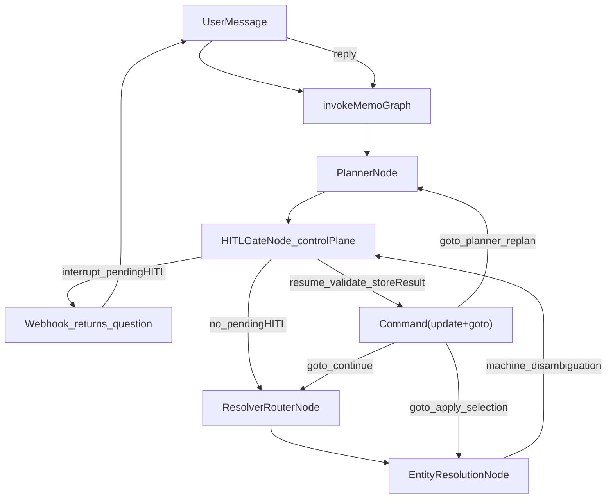

# Memo V2 — Planner & HITL (Current Flow Contract)

This doc explains **exactly** how Planner + HITL work in the current Memo_v2 runtime, including the canonical `pendingHITL` control-plane contract.

## Canonical code

- Graph + routers + timeout: `Memo_v2/src/graph/index.ts`
- Planner: `Memo_v2/src/graph/nodes/PlannerNode.ts`
- HITL control-plane: `Memo_v2/src/graph/nodes/HITLGateNode.ts`
- Entity resolution: `Memo_v2/src/graph/nodes/EntityResolutionNode.ts`
- State: `Memo_v2/src/graph/state/MemoState.ts`
- Types: `Memo_v2/src/types/index.ts`, `Memo_v2/src/types/hitl.ts`

## Overview

Planner produces a structured `plannerOutput` plan. HITL uses LangGraph `interrupt()` to pause when execution is risky or under-specified, and resumes via `Command({ resume: userMessage })`.

The HITL system uses a **single canonical contract**: one `pendingHITL` object in state at a time, with deterministic resume routing via `Command({ update, goto })`.

There are **two HITL families** (both managed by `HITLGateNode`):

- **Planner HITL**: Clarification / approval (low confidence, missing fields, high risk, needs approval, intent unclear).
- **Entity-resolution HITL**: Disambiguation selection (user chooses between candidate entities).

## Architecture diagram



## 1) Planner output contract (LLM)

Planner writes `state.plannerOutput`:

- `intentType`: `"operation" | "conversation" | "meta"`
- `confidence`: \(0..1\)
- `riskLevel`: `"low" | "medium" | "high"`
- `needsApproval`: boolean
- `missingFields`: string[] — when non-empty, triggers `reason:'missing_fields'` HITL. Known values (see PlannerNode system prompt): `reminder_time_required` (reminder needs specific date+time; use when user said "תזכיר לי" with day but no time, or no date/time), `target_unclear`, `time_unclear`, `which_one`, `intent_unclear`.
- `plan`: `PlanStep[]`

Planner also writes `state.routingSuggestions` (pattern hints) used for HITL clarification wording.

Planner receives `state.latestActions` (last 3, most-recent first) as a tiny hint block. When user uses referential language ("it/that/זה/אותו"), planner uses the most-recent action as the strongest candidate. Only emits `intent_unclear` when no latestAction is plausible.

## 2) HITL trigger rules

In `HITLGateNode.checkPlannerHITLConditions()` (priority order):

1. If `missingFields` includes **`intent_unclear`** → `reason:'intent_unclear'`, `kind:'clarification'`
2. Else if `confidence < 0.7` → `reason:'low_confidence_plan'`, `kind:'clarification'`
3. Else if `missingFields.length > 0` → `reason:'missing_fields'`, `kind:'clarification'`
4. Else if `riskLevel === 'high'` → `reason:'high_risk'`, `kind:'approval'`
5. Else if `needsApproval === true` → `reason:'needs_approval'`, `kind:'approval'`
6. Else → continue (no HITL)

For entity disambiguation:
- If `state.disambiguation` has unresolved candidates → `kind:'disambiguation'`, `source:'entity_resolution'`

## 3) PendingHITL contract

When HITL is triggered, `HITLGateNode` creates exactly one `PendingHITL` object:

```typescript
{
  version: 1,
  hitlId: string,          // UUID, unique per interruption
  kind: HITLKind,          // 'clarification' | 'approval' | 'disambiguation'
  source: HITLSource,      // 'planner' | 'entity_resolution' | ...
  reason: HITLReason,      // 'intent_unclear' | 'missing_fields' | 'high_risk' | ...
  originStepId: string,    // Ties to triggering step
  returnTo: HITLReturnTo,  // Deterministic resume destination
  expectedInput: HITLExpectedInput,  // 'yes_no' | 'single_choice' | 'multi_choice' | 'free_text'
  question: string,        // User-facing question text
  options?: PendingHITLOption[],     // Machine-controlled options
  policySource?: HITLPolicySource,   // For approval audit
  expiresAt: string,       // ISO timestamp (TTL = 5 minutes)
  context?: { ... },       // Disambiguation-specific context
  createdAt: string,
}
```

### returnTo mapping

| Source | Reason | returnTo |
|--------|--------|----------|
| planner | intent_unclear | `{ node:'planner', mode:'replan' }` |
| planner | missing_fields, low_confidence, confirmation, high_risk, approval | `{ node:'resolver_router', mode:'continue' }` |
| entity_resolution | disambiguation | `{ node:'entity_resolution', mode:'apply_selection' }` |

## 4) Resume validation

On resume, `HITLGateNode` validates the user's reply against `expectedInput`:

- **yes_no**: Normalizes multilingual yes/no (Hebrew/English)
- **single_choice**: Accepts numeric (1-based) or option id/label
- **multi_choice**: Accepts "2 3" / "2,3" / "both"/"all"/"שניהם"/"כולם"
- **free_text**: Non-empty

On **invalid**: re-interrupts with same `hitlId` and error-prefixed question.

On **valid**: writes `hitlResults[hitlId]`, clears `pendingHITL`, routes via `Command({ update, goto })`.

## 5) HITL result storage

```typescript
hitlResults[hitlId] = {
  raw: string,      // User's raw reply
  parsed: any,      // Validated/normalized value
  at: string,       // ISO timestamp
  returnTo?: HITLReturnTo  // Audit trail
}
```

## 6) Multi-HITL guard

If `pendingHITL !== null` and a new HITL condition is triggered in the same run:
- Logs `HITL_DUPLICATE_ATTEMPT`
- Ignores the new request
- Continues with the existing `pendingHITL`

This prevents race-like behavior if planner + resolver both request HITL in the same tick.

## 7) Expiry policy

### Expiry (pendingHITL.expiresAt)

- Default TTL: **5 minutes** (`HITL_TTL_MS` in `Memo_v2/src/types/hitl.ts`)
- On resume, if `now > expiresAt`:
  - Clear pending HITL (delete thread checkpoints)
  - Respond: "That request expired — want to try again?"
  - Log `HITL_EXPIRED`
  - Do not resume tool execution

When there is no pending interrupt, every user message is treated as a fresh invocation (planner runs with full context). No stale-reply guard is applied.

## 8) Resolver caching on resume

After any HITL resume, the graph re-enters and routes forward.

To prevent repeated resolver LLM calls:
- `ResolverRouterNode` checks `state.resolverResults.get(step.id)` and if present returns the cached result.

## 9) LLM guardrails

- LLM may generate **question text only**.
- LLM must never control: `options[].id`, `options[].label`, option count/order, `expectedInput`, `returnTo`, or metadata.
- For disambiguation, LLM is not used — question is template-based with machine-controlled options.

## 10) Structured logging

All HITL events use JSON-structured logs with `traceId` and `threadId`:

- `HITL_CREATED`: `{ traceId, threadId, hitlId, kind, reason, source, returnTo }`
- `HITL_RESUME_VALID`: `{ traceId, threadId, hitlId, parsedResult, returnTo }`
- `HITL_INVALID_REPLY`: `{ traceId, threadId, hitlId, expectedInput, rawReply }`
- `HITL_EXPIRED`: `{ traceId, threadId, hitlId, originStepId }`
- `HITL_DUPLICATE_ATTEMPT`: `{ traceId, threadId, existingHitlId, newSource }`
