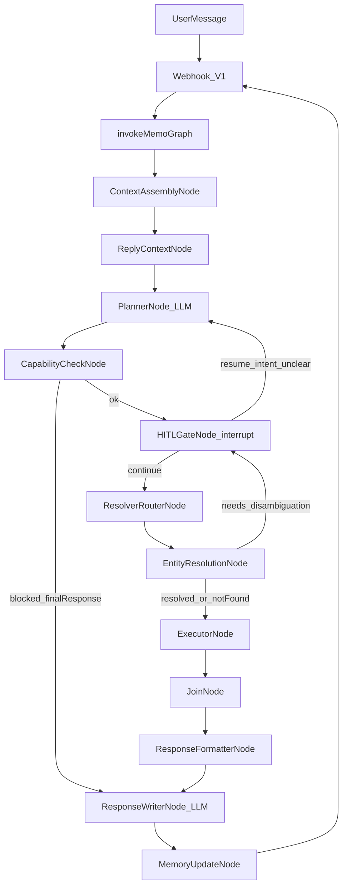
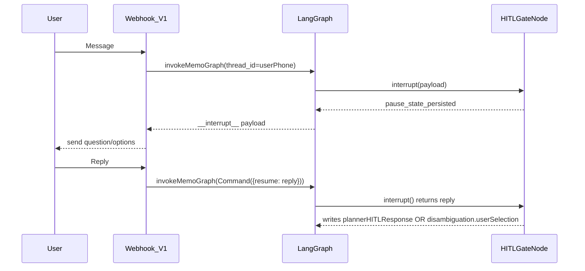
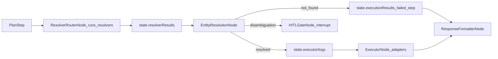
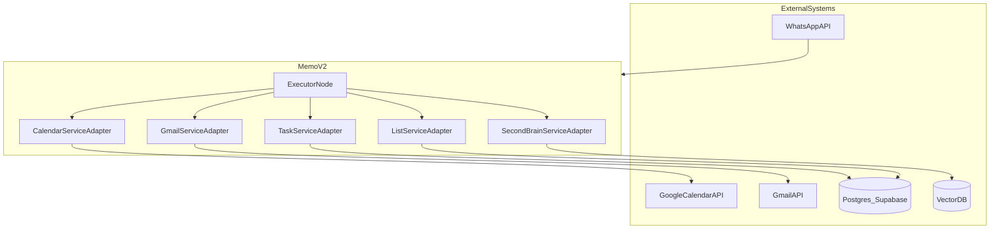

# Memo V2 — System Diagram (Current Runtime)

This document is the **current** system diagram for Memo_v2 as implemented today.

If any diagram here contradicts code, **code wins**. Update this file.

## Canonical implementation references

- Graph + routers + interrupt timeout: `Memo_v2/src/graph/index.ts`
- Runtime state contract: `Memo_v2/src/graph/state/MemoState.ts`
- Cross-node types: `Memo_v2/src/types/index.ts`

## 1) End-to-end flow (user message → response)

## 2) HITL interrupt/resume model (LangGraph)

**Two HITL families** exist in the current runtime:

- **Planner HITL** (clarification/confirmation/approval/intent_unclear): handled inside `HITLGateNode`, writes `plannerHITLResponse` on resume.
- **Entity-resolution HITL** (disambiguation selection): requested by `EntityResolutionNode` (`needsHITL + disambiguation + hitlReason='disambiguation'`) and surfaced via `HITLGateNode`.

## 3) Resolver → entity resolution → execution (current contracts)

Key contracts:
- Resolvers return semantic args in `state.resolverResults`.
- Entity resolution produces ID-resolved args in `state.executorArgs` (preferred by executor).
- Only true disambiguation interrupts execution; not_found continues to response with a friendly explanation.

## 4) External systems and service adapters (current)

- **Calendar/Gmail** require hydrated `authContext` (tokens) provided by `ContextAssemblyNode`.
- **Database/SecondBrain** use userPhone-based adapters.

