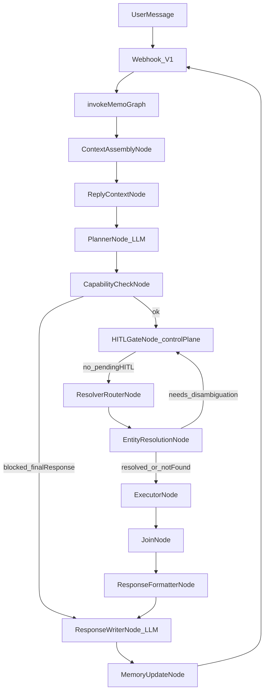
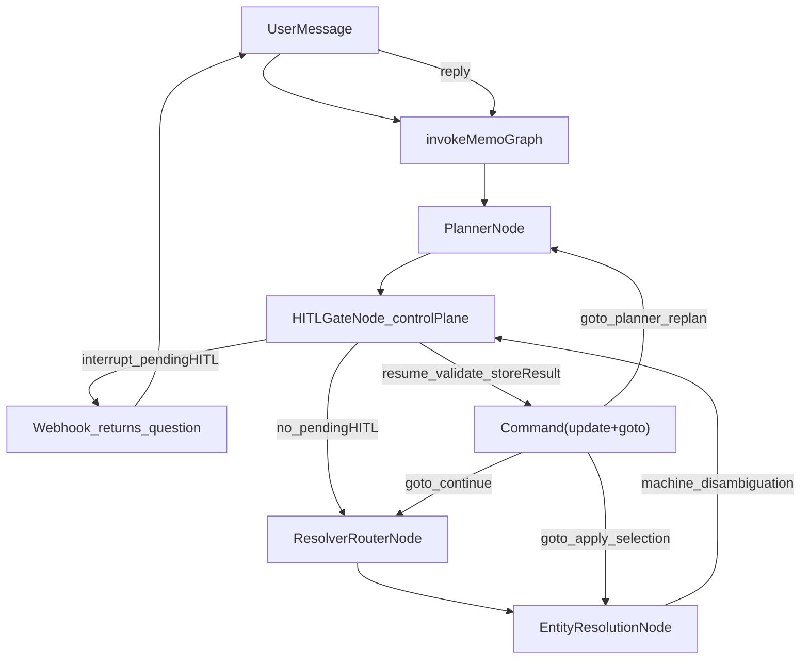
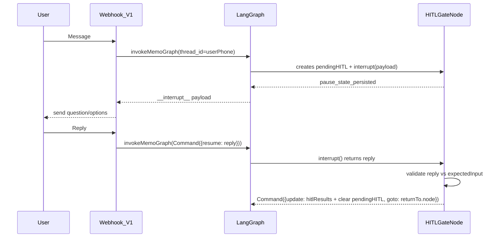
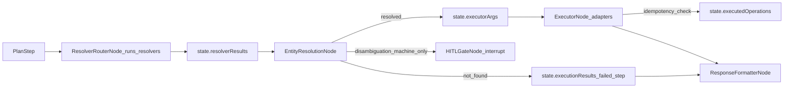
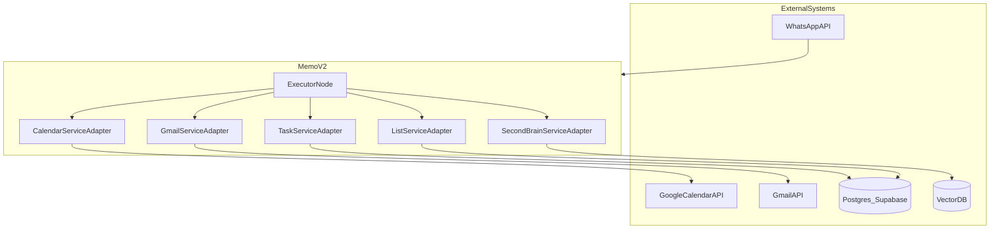

# Memo V2 — System Diagram (Current Runtime)

This document is the **current** system diagram for Memo_v2 as implemented today.

If any diagram here contradicts code, **code wins**. Update this file.

## Canonical implementation references

- Graph + routers + interrupt timeout: `Memo_v2/src/graph/index.ts`
- Runtime state contract: `Memo_v2/src/graph/state/MemoState.ts`
- Cross-node types: `Memo_v2/src/types/index.ts`
- Canonical HITL types: `Memo_v2/src/types/hitl.ts`

## 1) End-to-end flow (user message → response)

## 2) HITL control-plane (pendingHITL contract)

`HITLGateNode` is the single HITL control-plane. It manages one `pendingHITL` at a time and routes via `Command({ update, goto })`.

## 3) HITL interrupt/resume sequence

## 4) Resolver → entity resolution → execution

Key contracts:
- Resolvers return semantic args in `state.resolverResults`.
- Entity resolution produces ID-resolved args in `state.executorArgs` (preferred by executor).
- Disambiguation state is **machine-only** (candidates + metadata, no user-facing text).
- Only true disambiguation routes to HITL; not_found continues to response with explanation.
- Executor enforces **idempotency** via `executedOperations[traceId:stepId]` ledger.

## 5) External systems and service adapters

- **Calendar/Gmail** require hydrated `authContext` (tokens) provided by `ContextAssemblyNode`.
- **Database/SecondBrain** use userPhone-based adapters.

