# Memo V2 System Architecture Diagrams

> **Status**: System Architecture Documentation  
> **Last Updated**: January 2026  
> **Purpose**: Visual system diagrams for Memo V2 LangGraph architecture

---

## Table of Contents

1. [High-Level System Overview](#1-high-level-system-overview)
2. [LangGraph Flow Diagram](#2-langgraph-flow-diagram)
3. [Component Architecture](#3-component-architecture)
4. [Memory Architecture](#4-memory-architecture)
5. [Resolver & Executor Flow](#5-resolver--executor-flow)
6. [Data Flow Diagram](#6-data-flow-diagram)

---

## 1. High-Level System Overview


---

## 2. LangGraph Flow Diagram

```mermaid
flowchart TD
    START([User Message]) --> CA[ContextAssembly Node<br/>Code: Load user profile,<br/>timezone, memory]

    CA --> RC[ReplyContext Node<br/>Code: Handle reply-to,<br/>numbered lists, images]

    RC --> PL[Planner Node<br/>LLM: NL → Plan DSL]

    PL --> HITL{HITL Gate<br/>Code: Check confidence,<br/>risk, missing fields}

    HITL -->|confidence < 0.7<br/>OR missing_fields<br/>OR risk=high| INTERRUPT[interrupt<br/>Pause graph]
    HITL -->|OK| RR[Resolver Router<br/>Code: Build DAG,<br/>route to resolvers]

    INTERRUPT --> WAIT([Wait for User Reply])
    WAIT -->|Command resume| RR

    RR --> PARALLEL{Parallel Execution}

    PARALLEL --> CR[Calendar Find<br/>Resolver LLM]
    PARALLEL --> CMR[Calendar Mutate<br/>Resolver LLM]
    PARALLEL --> DTR[Database Task<br/>Resolver LLM]
    PARALLEL --> DLR[Database List<br/>Resolver LLM]
    PARALLEL --> GR[Gmail Resolver LLM]
    PARALLEL --> SBR[Second Brain<br/>Resolver LLM]

    CR --> CE[Calendar Executor<br/>Code: API calls]
    CMR --> CE
    DTR --> DE[Database Executor<br/>Code: DB operations]
    DLR --> DE
    GR --> GE[Gmail Executor<br/>Code: API calls]
    SBR --> SBE[Second Brain Executor<br/>Code: Vector DB]

    CE --> JOIN[Join Node<br/>Code: Merge results,<br/>detect failures]
    DE --> JOIN
    GE --> JOIN
    SBE --> JOIN

    JOIN --> RF[Response Formatter<br/>Code: ISO dates → human,<br/>categorization]

    RF --> RW[Response Writer<br/>LLM: Tone, phrasing,<br/>UX polish]

    RW --> MU[Memory Update<br/>Code: Update recent_messages,<br/>long-term summary]

    MU --> END([Send WhatsApp Response])

    style PL fill:#90EE90
    style RW fill:#90EE90
    style CR fill:#90EE90
    style CMR fill:#90EE90
    style DTR fill:#90EE90
    style DLR fill:#90EE90
    style GR fill:#90EE90
    style SBR fill:#90EE90
    style HITL fill:#FFB6C1
    style INTERRUPT fill:#FFB6C1
```



---

## 3. Component Architecture


---

## 4. Memory Architecture


---

## 5. Resolver & Executor Flow

```mermaid
flowchart LR
    subgraph "Plan Step"
        PS[PlanStep<br/>capability: calendar<br/>action: update_event<br/>constraints: {...}]
    end

    subgraph "Resolver Layer (LLM)"
        RR[Resolver Router<br/>Routes to resolver]

        CR[Calendar Find<br/>Resolver]
        CMR[Calendar Mutate<br/>Resolver]
        DTR[Database Task<br/>Resolver]
        DLR[Database List<br/>Resolver]
        GR[Gmail Resolver]
        SBR[Second Brain<br/>Resolver]
        GENR[General Resolver]
        MR[Meta Resolver]
    end

    subgraph "Query Resolution"
        QR[Query Resolver<br/>Entity lookup<br/>Disambiguation]
    end

    subgraph "Resolver Result"
        RES{Resolver Result}
        EXEC_TYPE[type: execute<br/>args: {...}]
        CLARIFY_TYPE[type: clarify<br/>question: string<br/>options: array]
    end

    subgraph "Executor Layer (Code)"
        CE[Calendar Executor<br/>Calendar Service]
        DE[Database Executor<br/>Task/List Service]
        GE[Gmail Executor<br/>Gmail Service]
        SBE[Second Brain Executor<br/>Second Brain Service]
    end

    subgraph "Execution Result"
        ER[Execution Result<br/>success: boolean<br/>data: any<br/>error: string]
    end

    PS --> RR
    RR --> CR & CMR & DTR & DLR & GR & SBR & GENR & MR

    CMR -.->|if no eventId| QR
    DTR -.->|if no taskId| QR
    GR -.->|if no emailId| QR

    QR -->|candidates found| CLARIFY_TYPE
    QR -->|one match| EXEC_TYPE

    CR --> EXEC_TYPE
    CMR --> EXEC_TYPE
    DTR --> EXEC_TYPE
    DLR --> EXEC_TYPE
    GR --> EXEC_TYPE
    SBR --> EXEC_TYPE
    GENR --> EXEC_TYPE
    MR --> EXEC_TYPE

    EXEC_TYPE --> CE & DE & GE & SBE
    CLARIFY_TYPE --> HITL[HITL Gate<br/>interrupt]

    CE --> ER
    DE --> ER
    GE --> ER
    SBE --> ER

    style PS fill:#fff4e1
    style CR fill:#90EE90
    style CMR fill:#90EE90
    style DTR fill:#90EE90
    style DLR fill:#90EE90
    style GR fill:#90EE90
    style SBR fill:#90EE90
    style GENR fill:#90EE90
    style MR fill:#90EE90
    style CLARIFY_TYPE fill:#FFB6C1
    style HITL fill:#FFB6C1
```

---

## 6. Data Flow Diagram


---

## 7. HITL (Human-in-the-Loop) Flow


---

## 8. Cron & Scheduled Jobs Flow


---

## Legend

### Node Types

- 🟢 **Green (LLM Nodes)**: Nodes that make LLM calls (Planner, Resolvers, Response Writer)
- 🔵 **Blue (Code Nodes)**: Nodes that execute code logic (Context, HITL, Executors, Formatters)
- 🟡 **Yellow (State/Storage)**: State management and storage layers
- 🔴 **Red (Control Flow)**: HITL interrupts and control logic
- ⚪ **White (V1 Services)**: Services reused from V1 without modification

### Data Flow

- **Solid arrows**: Direct data flow
- **Dashed arrows**: Optional or conditional flow
- **Bidirectional arrows**: Read/write access

### Notes

- All V1 services are reused without modification
- LangGraph provides state management and pause/resume via checkpointer
- LLM calls are centralized through LLM Service configuration manager
- HITL uses LangGraph's native `interrupt()` mechanism

---

_For detailed specifications, see [BLUEPRINT.md](./BLUEPRINT.md)_
