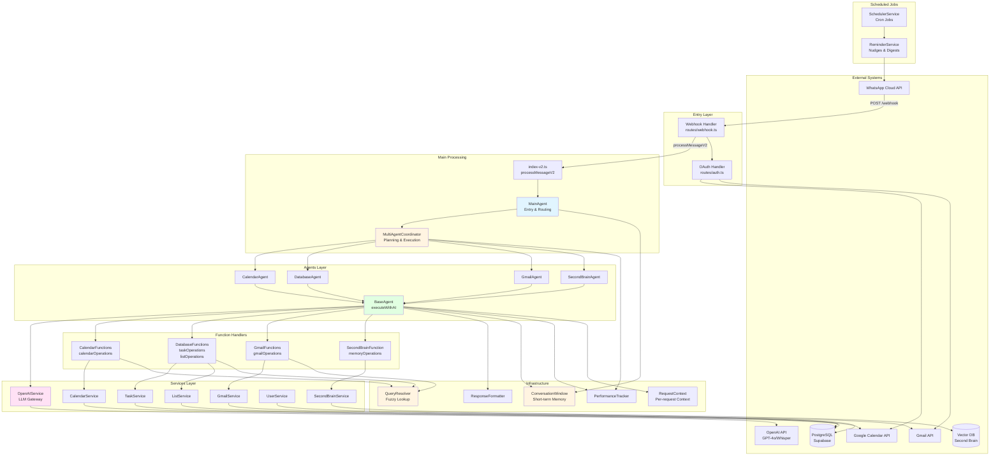
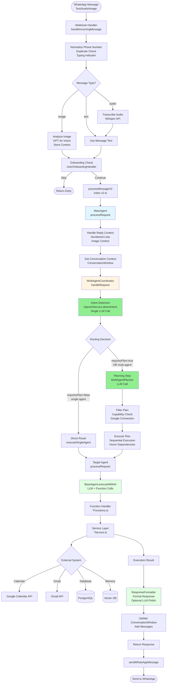
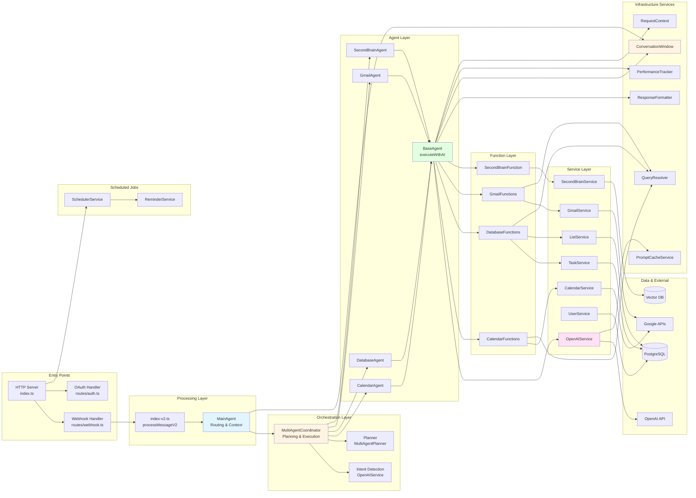
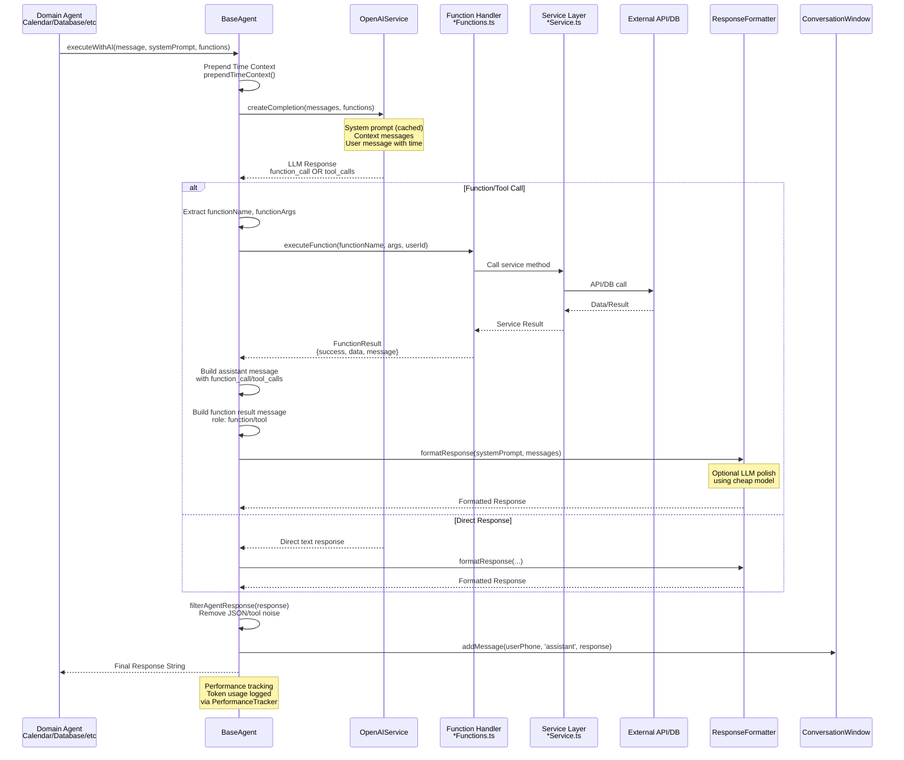
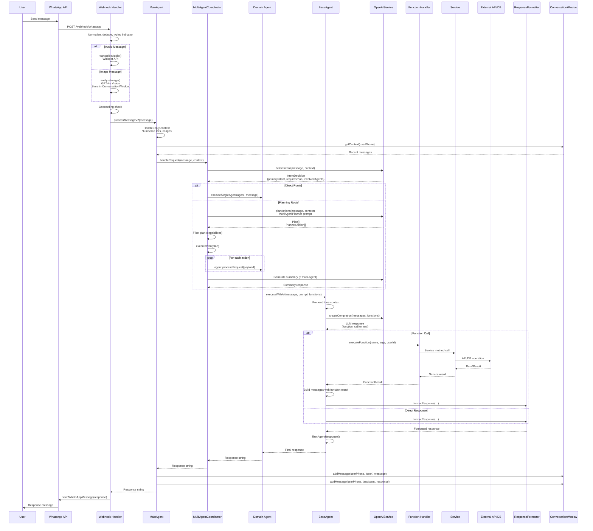
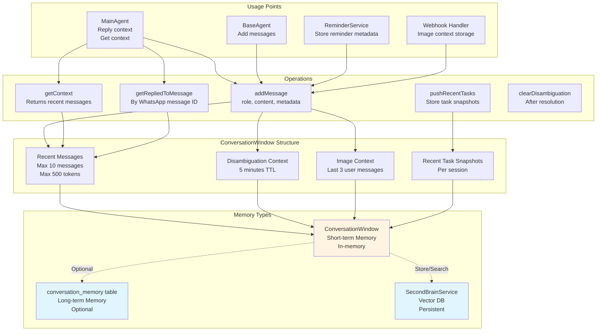
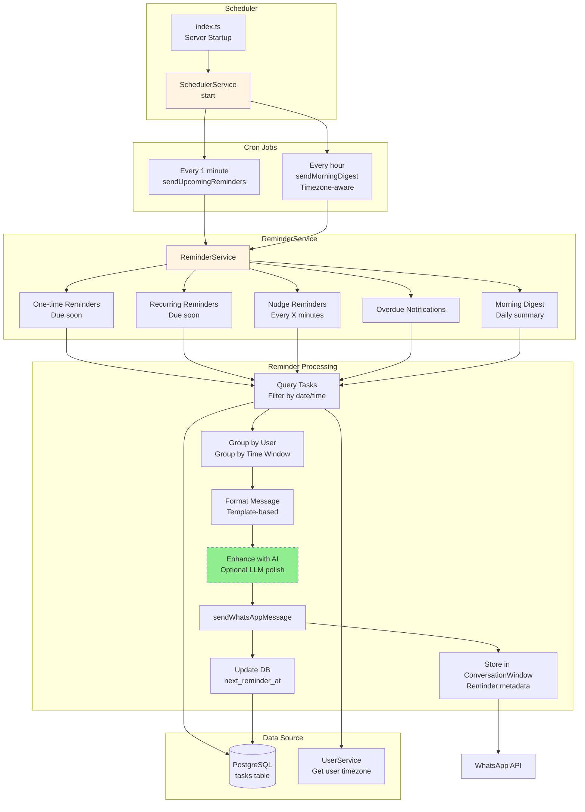

# Focus WhatsApp Assistant V1 - System Architecture Diagrams

> **Status**: System Architecture Documentation  
> **Last Updated**: January 2026  
> **Purpose**: Visual system diagrams for Focus WhatsApp Assistant V1 architecture

---

## Table of Contents

1. [High-Level System Overview](#1-high-level-system-overview)
2. [Message Processing Flow](#2-message-processing-flow)
3. [Component Architecture](#3-component-architecture)
4. [Agent & Orchestration Flow](#4-agent--orchestration-flow)
5. [BaseAgent Execution Flow](#5-baseagent-execution-flow)
6. [Data Flow Diagram](#6-data-flow-diagram)
7. [Memory & Context Management](#7-memory--context-management)
8. [Cron & Scheduled Jobs](#8-cron--scheduled-jobs)

---

## 1. High-Level System Overview



---

## 2. Message Processing Flow



---

## 3. Component Architecture



---

## 4. Agent & Orchestration Flow

```mermaid
flowchart TD
    USER_MSG[User Message] --> MAIN[MainAgent.processRequest]

    MAIN --> REPLY[Handle Reply Context<br/>Numbered Lists<br/>Image Context]

    REPLY --> CONV[Get Conversation Context<br/>ConversationWindow.getContext]

    CONV --> COORD[MultiAgentCoordinator<br/>handleRequest]

    COORD --> INTENT[Intent Detection<br/>OpenAIService.detectIntent<br/>Single LLM Call]

    INTENT --> INTENT_RES{Intent Result}

    INTENT_RES -->|primaryIntent=general| GEN[Generate General Response<br/>MainAgent Prompt]
    INTENT_RES -->|involvedAgents=[]| GEN
    INTENT_RES -->|Valid Intent| RESOLVE[Resolve Involved Agents]

    RESOLVE --> ROUTE{Route Decision<br/>requiresPlan?<br/>agentCount?}

    ROUTE -->|requiresPlan=false<br/>AND single agent| DIRECT[Direct Route<br/>executeSingleAgent]
    ROUTE -->|requiresPlan=true<br/>OR multi-agent| PLAN_STEP[Planning Step<br/>MultiAgentPlanner Prompt<br/>LLM Call]

    PLAN_STEP --> PLAN_RES[Plan Array<br/>PlannedAction[]]

    PLAN_RES -->|empty plan| FALLBACK{agentCount = 1?}
    FALLBACK -->|yes| DIRECT
    FALLBACK -->|no| NO_ACTION[No Action Response]

    PLAN_RES -->|valid plan| FILTER[Filter Plan<br/>Capability Check<br/>Google Connection]

    FILTER -->|no allowed actions| DENIED[Capability Denied Message]
    FILTER -->|allowed actions| EXEC[Execute Plan<br/>Sequential Execution]

    DIRECT --> AGENT_EXEC[Agent Execution<br/>agent.processRequest]
    EXEC --> AGENT_EXEC

    AGENT_EXEC --> BASE[BaseAgent.executeWithAI]

    BASE --> RESULT[Execution Result]

    EXEC --> COLLECT[Collect Results<br/>ExecutionResult[]]
    COLLECT --> SUMMARY{Multi-agent?}

    SUMMARY -->|single agent| COMBINE[Combine Responses]
    SUMMARY -->|multi-agent| SUMMARY_LLM[Generate Summary<br/>Multi-agent Summary Prompt<br/>LLM Call]

    COMBINE --> RETURN[Return Response]
    SUMMARY_LLM --> RETURN
    GEN --> RETURN
    NO_ACTION --> RETURN
    DENIED --> RETURN

    RETURN --> MAIN_RET[MainAgent Returns]

    style MAIN fill:#e1f5ff
    style COORD fill:#fff4e1
    style INTENT fill:#90EE90
    style PLAN_STEP fill:#90EE90
    style SUMMARY_LLM fill:#90EE90
    style BASE fill:#e1ffe1
```

---

## 5. BaseAgent Execution Flow



---

## 6. Data Flow Diagram



---

## 7. Memory & Context Management



---

## 8. Cron & Scheduled Jobs



---

## 9. QueryResolver Flow (Disambiguation)

```mermaid
flowchart TD
    USER[User Query<br/>"update the meeting"] --> RESOLVER[QueryResolver<br/>resolveOneOrAsk]

    RESOLVER --> TYPE{Entity Type}

    TYPE -->|calendar| CAL_QUERY[Query CalendarService<br/>getEvents with fuzzy search]
    TYPE -->|task| TASK_QUERY[Query TaskService<br/>getAll with filters]
    TYPE -->|list| LIST_QUERY[Query ListService<br/>getAll]
    TYPE -->|contact| CONTACT_QUERY[Query ContactService<br/>getAll]
    TYPE -->|email| GMAIL_QUERY[Query GmailService<br/>search]

    CAL_QUERY --> FUZZY[Fuzzy Matching<br/>fuzzy.ts<br/>Levenshtein distance]
    TASK_QUERY --> FUZZY
    LIST_QUERY --> FUZZY
    CONTACT_QUERY --> FUZZY
    GMAIL_QUERY --> FUZZY

    FUZZY --> MATCHES[Get Matches<br/>Score > threshold]

    MATCHES --> COUNT{Match Count}

    COUNT -->|0 matches| NOT_FOUND[Return Not Found<br/>null entity]
    COUNT -->|1 match| SINGLE[Return Single Match<br/>entity]
    COUNT -->|>1 matches| MULTIPLE[Return Disambiguation<br/>candidates array]

    MULTIPLE --> FORMAT[Format Disambiguation<br/>Numbered list<br/>Hebrew/English]

    FORMAT --> STORE[Store in ConversationWindow<br/>disambiguationContext]

    STORE --> USER_REPLY[User Replies<br/>"2" or "#1"]

    USER_REPLY --> PARSE[Parse Number Reference<br/>Extract index]

    PARSE --> SELECT[Select Candidate<br/>candidates[index-1]]

    SELECT --> SINGLE

    SINGLE --> RETURN[Return Entity<br/>Use for operation]
    NOT_FOUND --> RETURN_ERR[Return Error<br/>Entity not found]

    style RESOLVER fill:#fff4e1
    style FUZZY fill:#e1f5ff
    style STORE fill:#fff4e1
```

---

## Legend

### Component Types

- 🔵 **Blue (Entry/Orchestration)**: Entry points and orchestration logic (Webhook, MainAgent, Coordinator)
- 🟢 **Green (LLM)**: Components that make LLM calls (OpenAIService, Agents, Formatters)
- 🟡 **Yellow (Infrastructure)**: Infrastructure services (ConversationWindow, QueryResolver, PerformanceTracker)
- 🔴 **Red (External)**: External systems and APIs
- ⚪ **White (Services)**: Domain services and data layers

### Flow Types

- **Solid arrows**: Direct data flow and execution
- **Dashed arrows**: Optional or conditional flow
- **Bidirectional arrows**: Read/write access

### Key Design Patterns

1. **Agent Pattern**: All agents extend `BaseAgent` and use `executeWithAI` for LLM interaction
2. **Function Handler Pattern**: Functions define schemas and delegate to services
3. **Orchestration Pattern**: `MultiAgentCoordinator` handles multi-step and multi-agent workflows
4. **Context Injection**: Time context prepended to user messages (keeps prompts cacheable)
5. **Memory Management**: `ConversationWindow` manages short-term memory, `SecondBrainService` for long-term

---

## Key Architectural Principles

1. **Single LLM Gateway**: All LLM calls go through `OpenAIService`
2. **Centralized Prompts**: All system prompts in `system-prompts.ts`
3. **Function Schema = Prompt Description**: Function schemas match what prompts describe
4. **No Confirmations**: Delete operations execute immediately (UX decision)
5. **Performance Tracking**: All AI calls logged with tokens, duration, function calls
6. **Language Mirroring**: System mirrors user language (Hebrew/English)

---

_For detailed specifications, see other documentation files in `docs/project-instruction/`_
